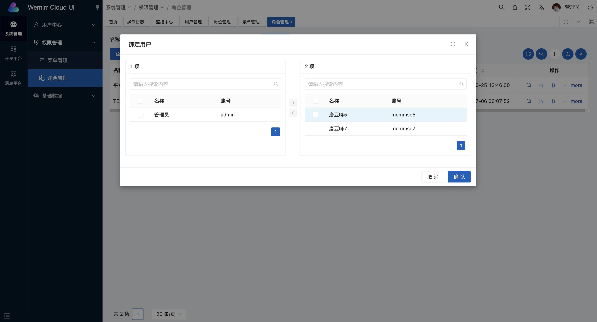
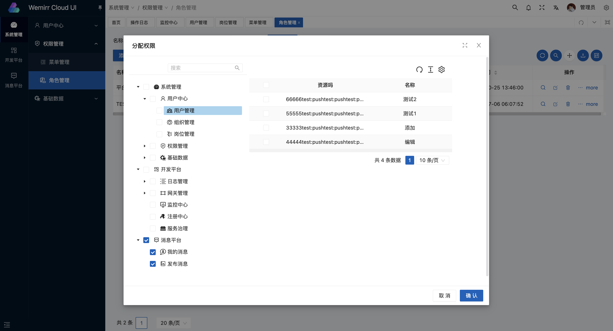
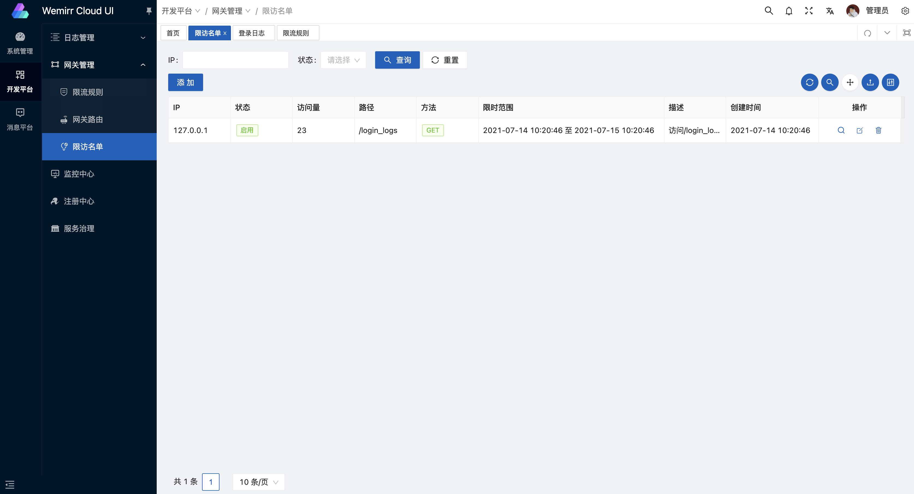
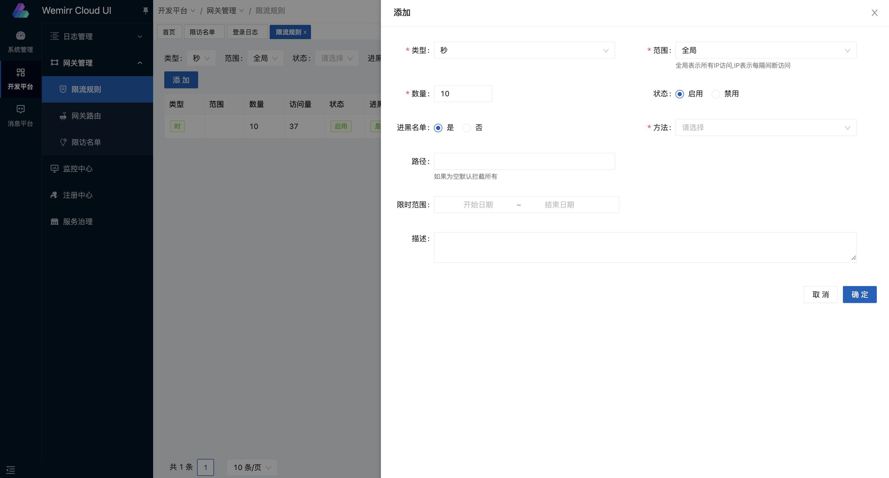
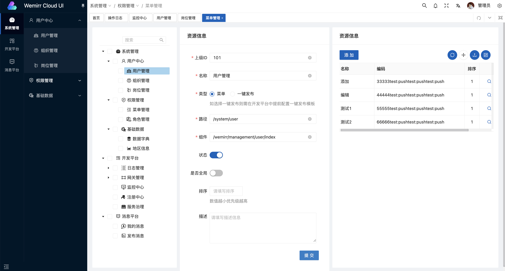
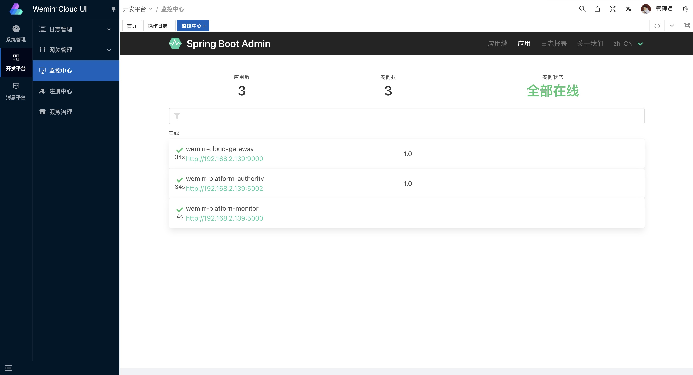
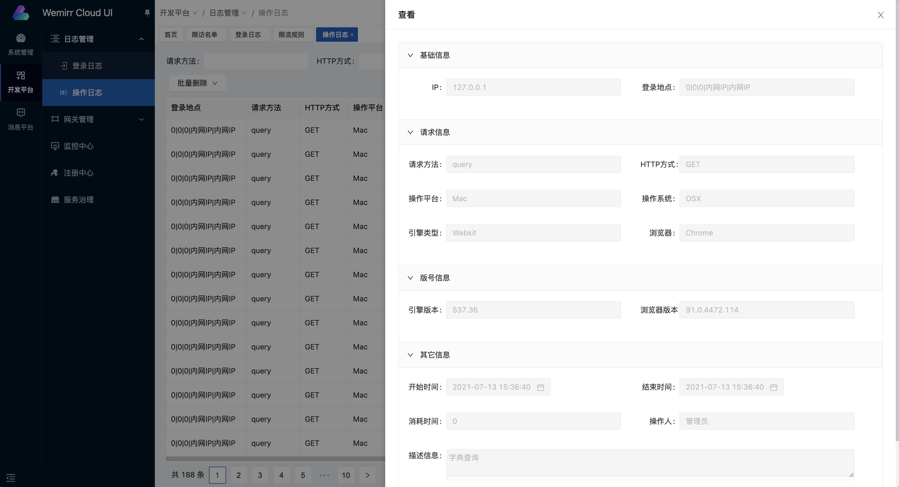
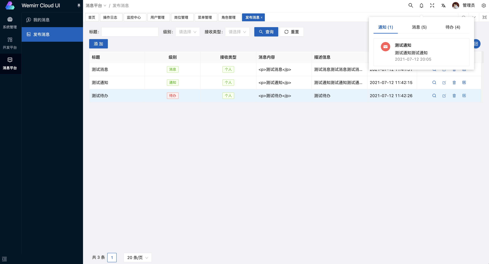
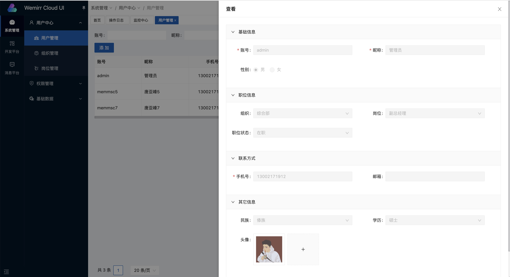

## 演示图




















## 文档

[文档地址](https://vvbin.cn/doc-next/)

## 准备

- [node](http://nodejs.org/) 和 [git](https://git-scm.com/) -项目开发环境
- [Vite](https://vitejs.dev/) - 熟悉 vite 特性
- [Vue3](https://v3.vuejs.org/) - 熟悉 Vue 基础语法
- [TypeScript](https://www.typescriptlang.org/) - 熟悉`TypeScript`基本语法
- [Es6+](http://es6.ruanyifeng.com/) - 熟悉 es6 基本语法
- [Vue-Router-Next](https://next.router.vuejs.org/) - 熟悉 vue-router 基本使用
- [Ant-Design-Vue](https://2x.antdv.com/docs/vue/introduce-cn/) - ui 基本使用
- [Mock.js](https://github.com/nuysoft/Mock) - mockjs 基本语法

## 安装使用

- 获取项目代码

```bash
git clone https://gitee.com/battcn/wemirr-platform-ui.git
```

- 安装依赖

```bash
cd vue-vben-admin

yarn install

yarn run lint:eslint
```

- 运行

```bash
yarn serve
```

- 打包

```bash
yarn build
```
