## 演示图
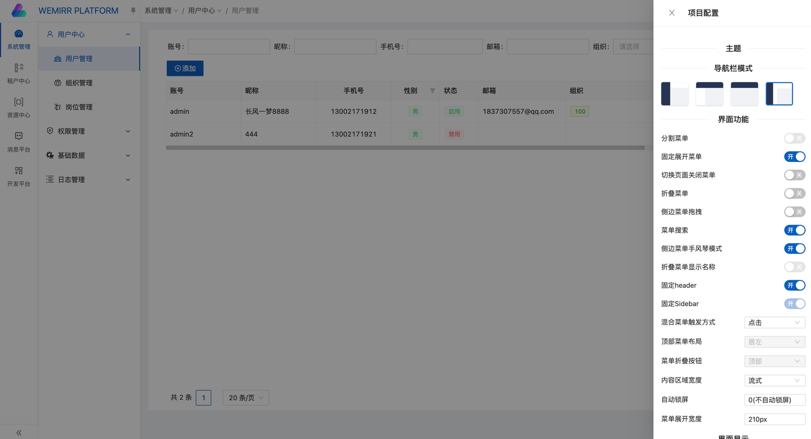
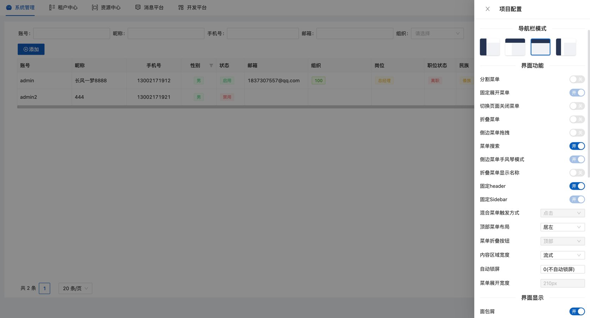
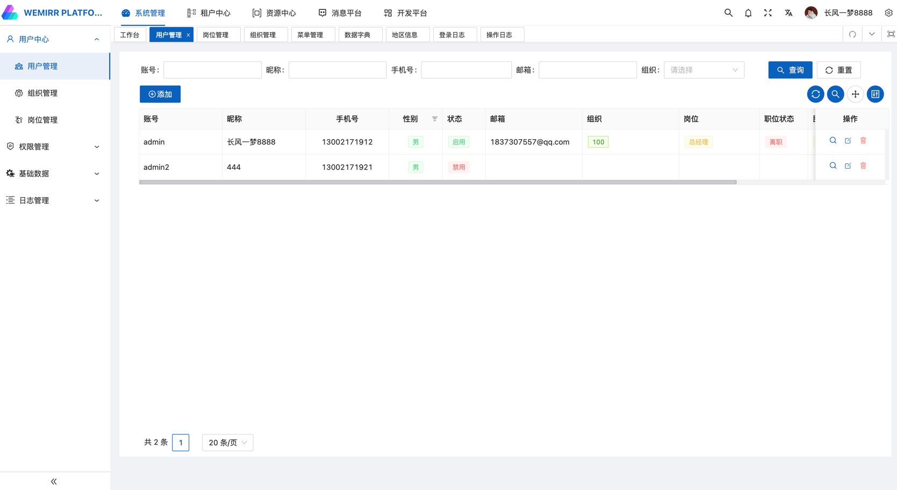
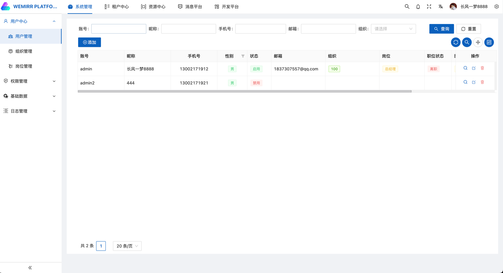

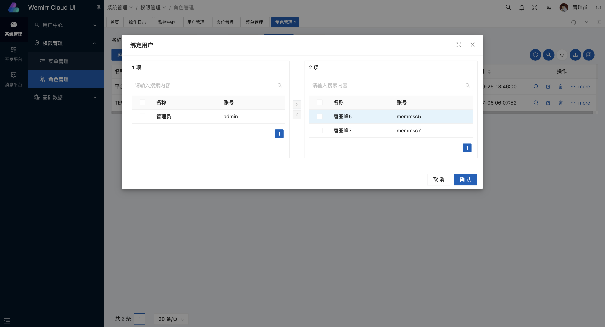

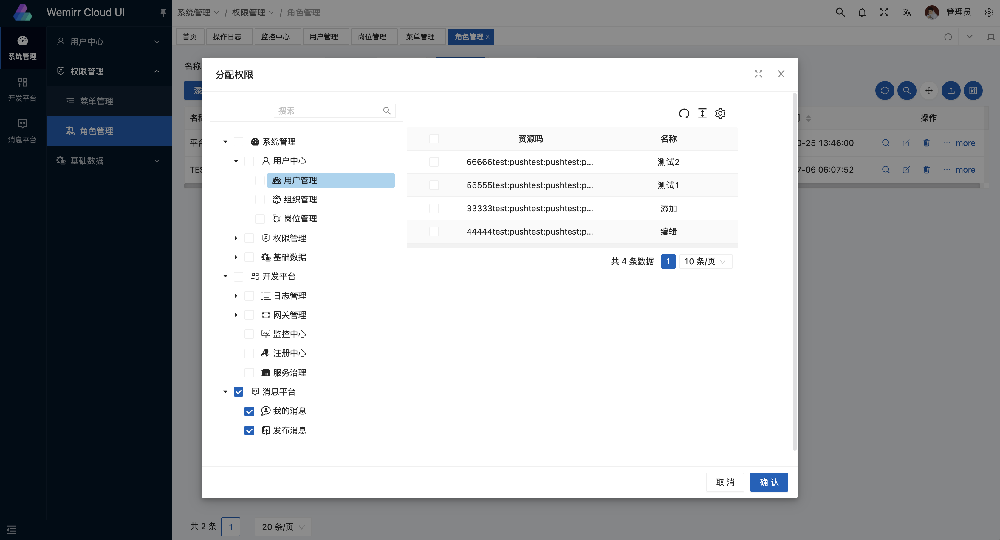

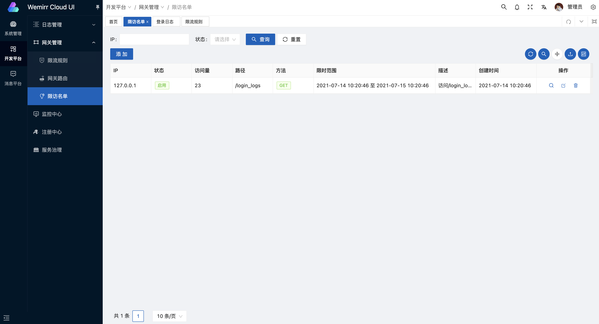

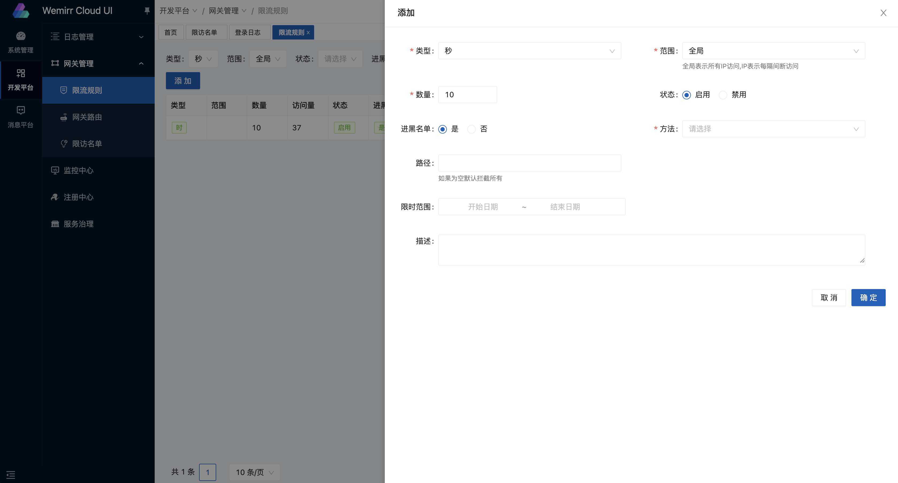

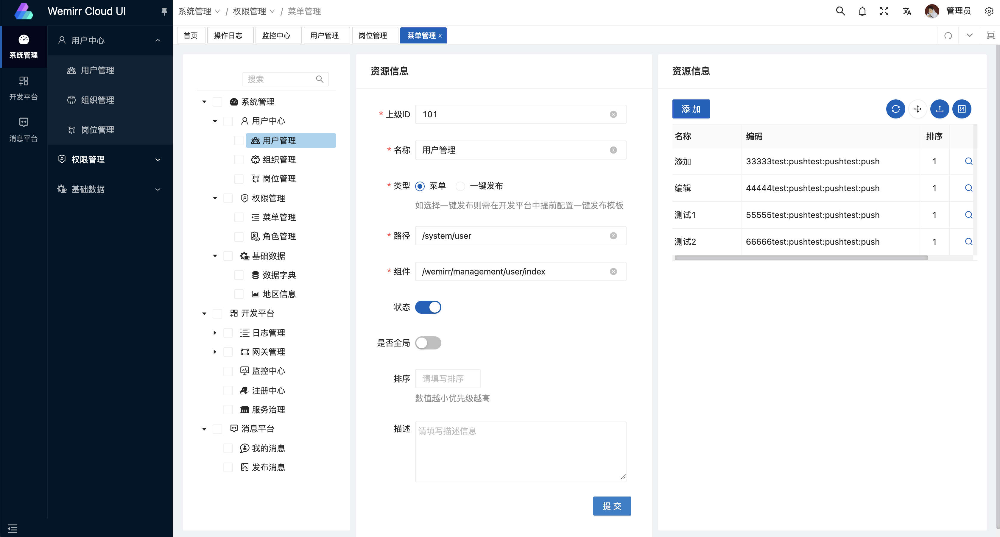

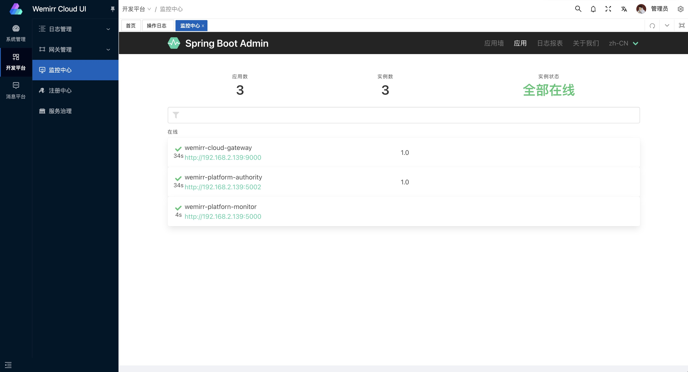

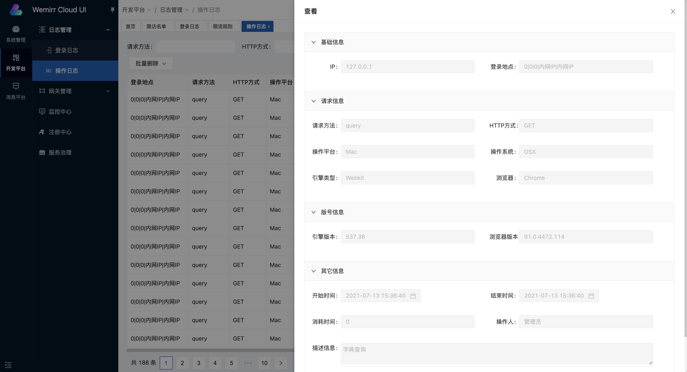

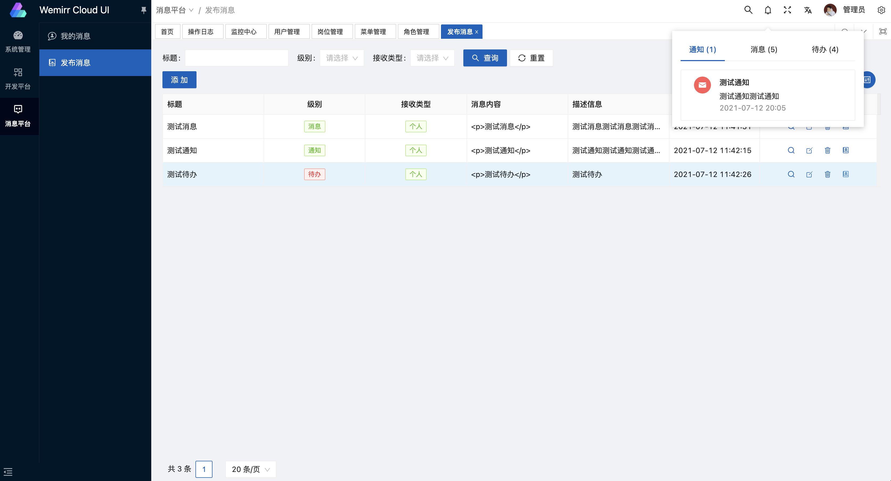

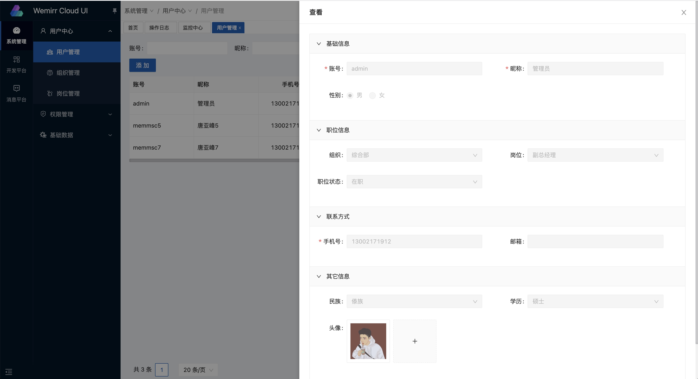

## 安装使用

- 获取项目代码

```bash
git clone https://gitee.com/battcn/wemirr-platform-ui.git
```

- 安装依赖

```bash
cd wemirr-platform-ui
# 如果没有 pnpm 请先安装 pnpm  
# npm install -g pnpm
pnpm install

```

- 运行

```bash
# 如果您已运行了配套后端, 那么请注释掉 
# vite.config.ts  target: "https://cloud.battcn.com/api" 将地址改成 http://localhost:9000
pnpm run dev:antd
```

- 打包

```bash
pnpm build
```

## 版本管理

**项目代码全部开源,非阉割版,有`Spring Cloud` 工作经验的 无需付费协助一样可以玩转项目**

| 版本     | 描述                                                                         |
|--------|----------------------------------------------------------------------------|
| v1-dev | ~~基于 Vue2.x 与 D2admin 进行开发（已废弃/不建议使用）~~                                    |
| v2-dev | 基于 Vue3.x 与 Vben2.x 版本进行开发（~~Vben2.x 官方已停止更新~~）配套 WP 后端 v2-dev / v2-master） |
| v3-dev | 基于 Vue3.x 与 Vben5.x 版本进行开发（强烈推荐,因为作者后期重心在它）                   |
